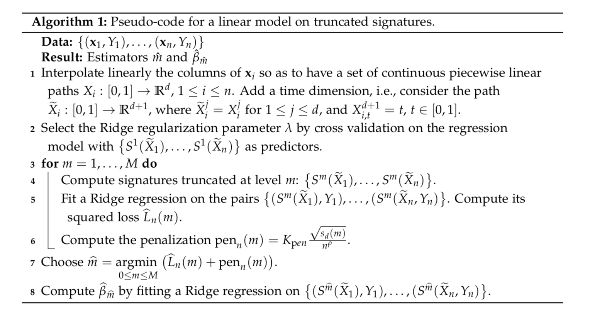

# Functional linear regression with truncated signatures ([preprint](https://arxiv.org/abs/2006.08442))

We propose a novel methodology for regressing a real output on vector-valued functional covariates. This methodology is based on the notion of signature, which is a representation of a function as an infinite series of its iterated integrals. The signature depends crucially on a truncation parameter for which an estimator is provided, together with theoretical guarantees. We provide here the code to compute an estimator of the truncation parameter, which is then used to implement a linear regression with signature features. The procedure is summarised below:

<p align="center">
    
</p>

## The code

The code is based on the [sacred](https://sacred.readthedocs.io/en/stable/) framework. To run an experiment, you need to specify a configuration in `configurations.py` and then run the script `main.py` with arguments the name of the configuration and the number of iterations. For example, if you want to do one run of a linear regression on signatures, with a constant `Kpen=1`, on simulated sinus data of dimension 2, you can use the configuration

```python
'my_test':
    {'d': [2],
     'regressor': ['signature'],
     'X_type': ['smooth'],
     'Y_type': ['mean'],
     'Kpen': [1.]
     }
```

and then run

```
python main.py my_test 1
```
The results of each experiment are stored in the `results` directory. They can be loaded in a dataframe with the function `get_ex_results` from `utils.py`. This is illustrated in the notebook `Analyse results.ipynb`.

The main arguments in a configuration are:
* regressor: regression model. Possible values are 'signature', 'bsplines', 'fourier', and 'fPCA'.
* selection_method: only used if regressor='signature', type of selection method of the truncation parameter. Possible values are 'cv' (selection by cross-validation) and 'estimation' (selection with the estimator defined in the paper)
* Kpen: only used if regressor='signature' and 'selection_method='estimation', value of the constant in the estimator of the truncation parameter. If it is None, then the slope heuristics method is used and the user has to manually enter it during the run.
* X_type: type of functional covariates. Possible values are 'smooth' (for the smooth sinus curves), 'gp' (for the Gaussian processes), and 'air_quality' (for the Air Quality dataset).
* Y_type: type of response, only used if X is simulated. Possible values are 'mean' and 'sig' (see the paper for more details)
* d: dimension of the functional covariates X (if simulated)
* npoints: number of sampling points of the functional covariates X (default npoints=100)
* ntrain: number of training samples (default ntrain=100)
* nval: number of validation samples (default nval=100)

## Reproducing the experiments

We give below the steps to reproduce the results of the paper.

### Environment

All the necessary packages may be set up by running
`pip install -r requirements.txt`

### Data

Download the Air Quality dataset from https://archive.ics.uci.edu/ml/datasets/Air+Quality and place the data at the location `data/UCI/AirQualityUCI/AirQualityUCI.csv`.

### Running the experiments

The configurations to reproduce the figures of the paper are in the file `configurations.py`. Then run

```
python main.py estimator_convergence 20
python main.py dim_study 20
python main.py dim_study_gp 20
python main.py air_quality 20
```
to obtain the respective experiments. Once the experiments are run, the notebook `Analyse results.ipynb` gives the exact code to obtain the figures of the paper.

## Citation

```bibtex
@article{fermanian2020linear,
  title={Linear functional regression with truncated signatures},
  author={Fermanian, Adeline},
  journal={arXiv:2006.08442},
  year={2020}
}
```

